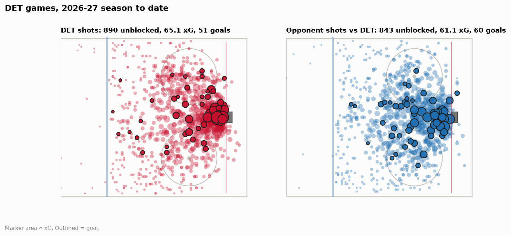

# Findings

_Generated by `make pipeline` from data through November 21, 2026
(last refresh 2026-11-22 19:09 UTC). Every number below is queried from the warehouse;
none are typed by hand. Interactive version: the
[live dashboard](https://winged-wheel-analytics.streamlit.app/)._

#### DET 2026-27 season to date

**23 GP, 8-12-3.**
DET has generated **70.2 xG** and allowed **66.3 xGA**
(51.4% xG share, rank 14 of 32). On those same shots they've
scored **54** goals against 70.2 expected (-16.2) and allowed
**66** against 66.3 expected (-0.3). At 5v5 the xG share is 52.3%.

| Situation | GP | xGF | GF | xGA | GA | xGF% |
|---|---|---|---|---|---|---|
| 5v5 | 23 | 49.2 | 39 | 44.8 | 44 | 52.3% |
| Power play | 22 | 15.0 | 11 | 1.9 | 1 | 88.7% |
| Shorthanded | 23 | 0.6 | 0 | 15.9 | 19 | 3.5% |
| Other (4v4, 3v3, EA) | 21 | 5.4 | 4 | 3.8 | 2 | 58.9% |
| All situations | 23 | 70.2 | 54 | 66.3 | 66 | 51.4% |

#### Player cards

| Player | Season | GP | G-A-P | TOI/GP | SOG | ixG | G − ixG | 5v5 on-ice xGF% |
|---|---|---|---|---|---|---|---|---|
| Dylan Larkin | 2026-27 | 10 | 2-4-6 | 21.7 | 32 | 3.41 | -1.41 | 60.3% |
| Dylan Larkin | 2025-26 | 74 | 34-33-67 | 20.2 | 225 | 33.68 | -3.68 | 47.9% |
| Lucas Raymond | 2026-27 | 23 | 9-13-22 | 19.8 | 62 | 7.58 | +1.42 | 51.9% |
| Lucas Raymond | 2025-26 | 80 | 25-51-76 | 18.8 | 172 | 19.65 | +4.35 | 49.4% |
| Moritz Seider | 2026-27 | 23 | 1-12-13 | 25.9 | 41 | 2.07 | -1.07 | 48.6% |
| Moritz Seider | 2025-26 | 82 | 10-50-60 | 25.7 | 187 | 9.83 | +0.17 | 55.2% |
| Simon Edvinsson | 2026-27 | 0 | – | – | – | – | – | – |
| Simon Edvinsson | 2025-26 | 72 | 9-16-25 | 22.4 | 86 | 5.63 | +1.37 | 52.1% |

_TOI and on-ice numbers come from official NHL shift charts, joined to every shot by game clock.
The NHL has published shift charts for 23 of DET's 23 games this season, so
TOI/GP and 5v5 on-ice xGF% use those games only. "–" means the player has not dressed._

#### League context and the xG model

For context, in 2025-26 DET posted a 50.3% xG share (rank 14 of 32), scored 34.7 fewer goals than its xG, and allowed 12.9 fewer than its xGA.

On the held-out 2025-26 season (111,099 unblocked shots), the model
scores **log loss 0.2226** vs. a 0.2490
constant-rate baseline, **ROC AUC 0.754**, and predicts
7,928 goals against 7,578 actual.
On 110,269 shots matched to MoneyPuck, shot-level correlation with their public xG is **0.59** (our log loss 0.2230 vs. MoneyPuck 0.2178).

### Game recap: DET vs NYI, Nov 21, 2026: L 2-3

DET won the expected-goals battle 2.55-2.50 on 40-39 unblocked attempts and lost the game 2-3.

| xG | P1 | P2 | P3 | Total |
|---|---|---|---|---|
| DET | 1.11 | 0.50 | 0.94 | 2.55 |
| NYI | 0.71 | 0.58 | 1.21 | 2.50 |

**Top chances**

| Time | Team | Shooter | Type | Dist (ft) | Situation | xG | Result |
|---|---|---|---|---|---|---|---|
| P2 4:53 | DET | Andrew Copp | snap | 7 | 5v5 | 0.32 |  |
| P1 4:38 | DET | Emmitt Finnie | snap | 12 | 5v5 | 0.29 |  |
| P3 17:15 | NYI | Bo Horvat | snap | 9 | 5v5 | 0.23 |  |
| P3 1:21 | DET | Marco Kasper | deflected | 8 | PP | 0.23 |  |
| P1 4:23 | NYI | Kyle Palmieri | snap | 15 | 5v5 | 0.22 |  |

